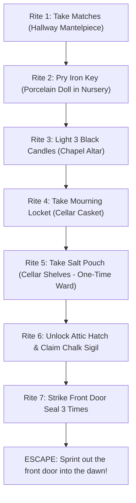

# The Hollow House — Game Guide, Lore & Technical Architecture

A first-person survival horror experience built with a custom retro-modern raycasting engine, procedural audio synthesis, and a photorealistic dynamic lighting viewmodel.

---

## 1. Storyline & Lore

### The Background (1889)
The Hollow House was once the residence of the Hollow family. In the winter of 1889, tragic and arcane events consumed the household. The mother, consumed by grief and forbidden occult rites, succumbed to the dark. Her portrait still hangs in the hallway — though her face has been violently scratched away from the *inside* of the canvas frame.

### The Haunting
You awaken inside the central hallway of the house. The heavy front door slams shut and locks itself behind you with a cursed seal. You are not alone: *she* is already inside the walls with you. 

Your only hope of survival is to perform **The Seven Rites** to break the occult seal on the front door and escape before your sanity extinguishes or she catches you in the dark.

---

## 2. Technology Stack & Architecture

The game is built with zero heavy 3D engine frameworks (no Three.js, Babylon.js, or WebGL overhead). Everything runs at native 60+ FPS in modern browsers using custom TypeScript canvas engines:

| Layer | Technologies Used | Purpose |
|---|---|---|
| **UI & State** | **React 18**, **TypeScript**, **Tailwind CSS v4** | HUD overlays, examine modals, inventory state, dialogs, timers |
| **Motion & FX** | **Hand-written CSS keyframes** (`src/index.css`) | Story bars, jumpscare flashes, grain jitter, scanlines, vignette pulses — no animation library is loaded |
| **Primary 3D World** | **Custom DDA Raycaster (HTML5 Canvas 2D)** | Real-time retro 3D raycasting with procedural grime, doors, and candle sprites |
| **Viewmodel & Lighting** | **Full-Resolution 2D Canvas Overlay** | Photorealistic tactical flashlight viewmodel, volumetric beam, dynamic dust motes |
| **Audio Engine** | **Web Audio API (Pure Procedural Synthesis)** | 100% synthesized footsteps, heartbeats, screams, mechanical clicks, and ambient horror sounds (0 external MP3s!) |
| **Asset Pipeline** | **Optimized WebP + Procedural Fallbacks** | Every photographic plate (torch, doll, casket, chalk, flames, her figure and her face) has a hand-drawn canvas fallback, so a failed load never leaves a hole in the scene |

### The Dual-Canvas Architecture
To achieve both a nostalgic 90s survival-horror aesthetic and crisp modern AAA lighting, the game runs a dual-canvas compositing pipeline:
1. **Background Canvas (`canvasRef`)**:
   - Renders at a fixed low resolution of **480 × 270** (`cols: 480, rows: 270`) and is stretched to the viewport with CSS `image-rendering: pixelated`.
   - Casts one ray per pixel column — **480 vertical wall slices** — plus wall textures, door opening animations, and pixelated sprite billboards sorted back-to-front against a per-column z-buffer.
2. **Foreground Viewmodel Canvas (`viewRef`)**:
   - Renders at native device pixel ratio (`Math.min(2, window.devicePixelRatio)`) on top of the pixelated world.
   - Calculates subpixel volumetric light rays, 46 drifting dust motes, Cree LED hot-spot glare, reflector bloom, and procedural sway/lag motions.

### Procedural Art Fallbacks (`src/ghostArt.ts`)
The ghost herself is never a pasted-in photograph — she is drawn live on canvas with swaying hair, hollow eyes, mist and flicker, and her two photographic plates are run through `apparitionPlate()` (cold grade, film grain, lifted blacks, feathered edges) so she dissolves into the scene.

The four sprite plates (her figure, the doll, the casket, the chalk circle) and the atmosphere backdrops (hallway, nursery, basement, chapel, attic) are bundled locally in `public/assets/` through `loadSprite()`, and wrap the `drawImage` in a try/catch with automatic fallback to procedural canvas art if needed. The backdrop `` tags carry their own `onError` handlers; a failed polaroid hides the whole card rather than leaving a blank cream rectangle on the title screen, and the full-screen jumpscare swaps to `drawScareFace()` on a procedural canvas.

The first-person torch is an $896 \times 1200$ WebP plate positioned by four landmarks — the Cree lens at `(236, 256)` and the wrist pivot at `(740, 1140)`. `drawView()` derives the beam origin from `atan2`/`hypot` of those landmarks, so the beam, halo and LED core always sit exactly on the lens. The plate's rotation is *not* hard-coded: the wrist pivot is anchored at the bottom-right, the aim angle is taken from that pivot to the crosshair at $(0.5\,v_w,\; 0.5\,v_h)$ — the raycaster's horizon, since walls are centred on `rows / 2` — and `rot = aim - baseAngle`. Barrel, lens and beam therefore share one axis at every window size (light does not bend at the glass), and the cone, whose half-width is $0.44\,v_h$, always opens on the crosshair instead of running off the top of the screen. The lens is clamped to $0.86\times$ the pivot→crosshair reach so a squarish window cannot push the barrel past the point being aimed at. If the bundled WebP and the `/assets` copy both fail to load, `drawTorchFallback()` paints a full tactical torch — gloved fist, knuckles, knurled battery tube, grip bands, power switch, finned flared head, crenellated bezel and reflector dish — along that same pivot→lens axis, and it is drawn *before* either image resolves so the very first frames already have something in the player's hand. Its grain pass runs under `globalCompositeOperation = 'source-atop'` so it can never show as a haze rectangle around the sprite.

---

## 3. Controls & Heads-Up Display (HUD)

### Controls

| Action | Desktop (Keyboard + Mouse) | Mobile / Touch |
|---|---|---|
| **Move** | `W` / `S` forward & back, `A` / `D` strafe, `↑` / `↓` forward & back | On-screen D-pad (`▲ ◀ ▼ ▶`) |
| **Look / Turn** | Mouse (pointer lock) or drag; `←` / `→` also turn | Drag anywhere on the screen |
| **Run / Sprint** | Hold `Shift` | Hold the **Run** button |
| **Interact / Pick Up** | `E`, or a quick left click (under 240 ms) | Tap the **E** button |
| **Flashlight Toggle** | `F` | Torch icon button |
| **Pause / Resume** | `P` or `Escape` | Pause button (top right) |
| **Mute Sound** | Speaker Button (Top Right) | Speaker Button |

> Holding the mouse button down instead *walks forward* — only a short, still click interacts.
> Key auto-repeat is ignored, so holding `E` or `F` fires exactly once.

### HUD Elements
- **Sanity Bar (Top Left)**: Drains when close to the ghost or standing in pitch black. Falling below 35% causes tunnel vision and blood vignettes; reaching 0% causes cardiac shock and instant death.
- **Stamina Bar**: Consumed while sprinting (`Shift`). Refills when walking or resting. If depleted to 0%, player suffers heavy exhaustion and cannot sprint until recovering past 22%.
- **Flashlight Battery**: Decreases while the flashlight is ON. Can be replenished by finding 9V batteries scattered around the house.
- **EMF Detector (Bottom Right)**: 5-level proximity sensor that measures paranormal frequency and beeps faster as the entity draws near.
- **Compass & Minimap (Bottom Right)**: Renders into a 288 × 288 backing store and is displayed at 144 px (100 px on touch), so the map is supersampled 2× and stays crisp on any display. It shows visited rooms, doors, candle altars, and player facing direction.

---

## 4. Step-by-Step Mission Walkthrough: The Seven Rites

### Rite 1: Take the MATCHES
- **Location**: Hallway mantelpiece examine zone (`x: 13.2, y: 16.2`, radius `1.05`).
- **Objective**: Collect the matchbox. Without matches, black candles in the chapel cannot be lit.
- **Lore**: *“Strike anywhere,” the box says. The box is unnervingly warm.*

### Rite 2: Pry the IRON KEY
- **Location**: The porcelain doll sprite in the Nursery (`x: 7.5, y: 8.5`). The nursery itself spans `x 5–10, y 5–11` behind the door at `(7, 12)`; the separate “The Crib” examine zone sits at `x: 5.9, y: 5.9`.
- **Objective**: Approach the porcelain doll and interact to pry loose the cold iron key.
- **Danger**: Visiting the nursery awakens the ghost's stalker instinct; her steps can be heard pacing overhead.

### Rite 3: Light the THREE BLACK CANDLES
- **Location**: The Chapel altar (`x 28–29, y 13–16`, behind the door at `(27, 14)`). The three candles are separate interactables at `(29.3, 13.7)`, `(29.3, 15.3)` and `(29.65, 14.5)`.
- **Objective**: Use matches to light each of the 3 black candles on the chapel altar.
- **Effect**: Each lit candle permanently illuminates the chapel with warm ambient light that never burns out, and the chapel becomes a **sanctuary that regenerates sanity** (see §6.4).

### Rite 4: Take the MOURNING LOCKET
- **Location**: The Cellar Casket sprite (`x: 8.5, y: 21.5`).
- **Objective**: Descend into the dark cellar (through the door at `(8, 17)`) and examine the funeral casket to retrieve the mourning locket.
- **Lore**: *Inside: a lock of child’s hair and one small tooth.*

### Rite 5: Take the SALT POUCH (Mother’s Ward)
- **Location**: Cellar shelf examine zone (`x: 9.0, y: 24.1`, radius `1.05`). The nearby “Jar Shelves” zone is at `x: 5.8, y: 19.4`.
- **Objective**: Collect the consecrated salt pouch.
- **Mechanic**: The salt is your **only active defense**. It is resolved *before* every aggressive state, so it also breaks a lunge already in flight: she recoils into the walls, you regain +8 Sanity, and **it works only once**. If the final seal is already broken, the ward buys a single 3.5-second breath — it does **not** cancel chase mode.

### Rite 6: Unlock the Attic & Claim the CHALK SIGIL
- **Location**: Attic hatch grid cell (`x: 14, y: 8`), reached up the stair shaft at `x: 14, y: 9–12`. The chalk sigil sprite waits in the rafters at `(14.5, 5.3)`.
- **Objective**: Use the Iron Key to unlock the attic hatch, climb into the attic (`x 12–17, y 3–7`), and take the chalk sigil from the ritual circle.

### Rite 7: Strike the Front Door Seal & ESCAPE
- **Location**: Sealed front door grid cell (`x: 30, y: 14`), flanked by altar stone at `y: 13, 15, 16`.
- **Objective**: Strike the glowing seal on the front door 3 times (`E` or a quick click). The seal only yields once all three candles are lit **and** you carry both the locket and the sigil.
- **The Climax**: The third strike breaks the lock over 1.6 seconds, but triggers **CHASE MODE**. The ghost screeches and sprints directly toward you through the house.
- **Escape**: Sprint east through the open doorway — you are out once `x > 31.15` and `|y − 14.5| < 1.4`.

### Batteries
Three 9V battery pickups are hidden around the house at `(20.5, 15.5)` in the hallway, `(6.5, 20.5)` in the cellar and `(13.5, 5.5)` in the attic. Each restores +55% charge and clears the low-battery warnings.

---

## 5. Ghost AI & Threat Mechanics

The ghost utilizes a state machine governed by line-of-sight checks and Breadth-First Search (BFS) grid pathfinding:

### AI States
1. **Wander Mode (`wander`)**:
   - The ghost randomly navigates between rooms at a creeping pace (`speed: 1.05`).
   - Scent/hearing timer: recalculates destination every 4–8 seconds.
   - Wander targets pass a `placeable()` guard, so she can never be routed back into the attic while its hatch is still locked — the attic has one exit and BFS cannot leave it, which would remove her from the night entirely.
2. **Stalk Mode (`stalk`)**:
   - Activated when the ghost has line-of-sight (LOS) within 9 tiles.
   - Moves quietly toward the player (`speed: 1.8`), maintaining a short 2-tile distance to induce psychological dread and drain sanity.
3. **Lunge Attack (`lunge`)**:
   - Triggered when within close proximity (`dist < 2.5 + phase * 0.35 tiles`) and LOS is clear.
   - Rushes the player at high velocity (`speed: 4.6`) for 0.55 s. She is fast but not intangible: each axis is collision-tested, and a lunge into plaster stops dead (the timer clamps to 0.12 s) rather than tunnelling through the wall. If it lands without a Salt Ward, it inflicts -12 Sanity and triggers a violent jumpscare before teleporting away.
4. **Chase Mode (`chase`)**:
   - Triggered upon the final rite.
   - The ghost continuously calculates optimal BFS paths (`speed: 2.95`) straight to the player. Touching her is fatal.

### Death Conditions
- **Caught (`cause: 'caught'`)**: Ghost reaches distance `< 1.0` in chase mode. Jumpscare plays for 1.2s, followed by the game over screen.
- **Sanity Shock (`cause: 'sanity'`)**: Sanity reaches 0%. The screen pulses with blood and collapses.

---

## 6. Under the Hood: Calculations, Rates & Formulas

### 1. Raycasting Digital Differential Analysis (DDA)
For each horizontal column $x \in [0, \text{cols}-1]$:
$$\text{cameraX} = \frac{2x}{\text{cols}} - 1$$
$$\vec{r} = \vec{\text{dir}} + \vec{\text{plane}} \cdot \text{cameraX}$$
Wall height slice:
$$\text{lineH} = \frac{\text{rows}}{\text{perpDist}}$$
Where $\text{perpDist}$ is the perpendicular distance to prevent fisheye lens distortion.

### 2. Dynamic Lighting Calculation (`lightAt`)
The illumination $L \in [0, 1]$ at any point $(x, y)$ is:
$$L = L_{\text{ambient}} + L_{\text{torch}} + L_{\text{spill}} + \sum_{i=1}^{3} L_{\text{candle}_i}$$
Where:
- $L_{\text{ambient}} = \text{diff.ambient} \times \text{flicker}$
- Angle difference: $\Delta\theta = |\text{atan2}(dy, dx) - \theta_{\text{facing}}|$
- Spotlight Cone: $\text{cone} = \max(0, 1 - \frac{\Delta\theta}{0.74})$ (approx $42.4^\circ$ half-beam)
- Distance Attenuation: $\text{att} = \max(0, 1 - \frac{d}{12.5})$
- Battery Beam Power: $\text{beam} = 0.45 + 0.55 \times \frac{\text{battery}}{100}$
- Torch Contribution: $L_{\text{torch}} = 1.05 \times \text{cone}^2 \times \text{att} \times \text{flicker} \times \text{beam}$
- Candle Contribution: $L_{\text{candle}} = 0.95 \times \max(0, 1 - \frac{d_c}{5.4})^2 \times (0.82 + 0.18\sin(9t + 2.4i))$

### 3. Flashlight Battery Drain Rate
$$\Delta\text{Battery} = -dt \times 0.55\% / \text{sec}$$
- Continuous life: $\approx 181.8 \text{ seconds}$ ($\approx 3 \text{ minutes}$).
- Low-battery warning triggers at $\le 25\%$.
- Heavy flickering and dimming triggers at $\le 15\%$.
- Each 9V Battery pickup adds $+55\%$ charge (capped at $100\%$) and resets the low-battery warnings.

### 4. Sanity Drain & Recovery
$$\Delta\text{Sanity} = \begin{cases} 
-dt \times 2.6 \times \text{diff.drain} & \text{if } \text{dist}_{\text{ghost}} < 3.0 \\
+dt \times 0.9 & \text{if } \text{dist}_{\text{ghost}} > 6.0 \\
-dt \times 0.5 & \text{if flashlight is OFF} \\
+dt \times (1.1 + 0.8 \times \text{litCandles}) & \text{if inside the chapel sanctuary}
\end{cases}$$
The chapel sanctuary applies only when at least one black candle is lit, she is more than 3 tiles away, and chase mode is **not** active — the region tested is `x ∈ (27.5, 30), y ∈ (12.5, 17)`. Stepping outside the chapel re-arms the one-shot log line that announces it.

### 5. Player Movement & Stamina
- **Walking Speed**: $2.6 \text{ tiles/sec}$
- **Sprint Speed**: $4.1 \text{ tiles/sec}$
- **Stamina Drain (Sprinting)**: $-dt \times 26\% / \text{sec}$ ($\approx 3.84 \text{ sec}$ max continuous sprint)
- **Stamina Recovery (Resting)**: $+dt \times 15\% / \text{sec}$ ($\approx 6.6 \text{ sec}$ to full)
- **Stamina Recovery (Walking)**: $+dt \times 9\% / \text{sec}$

### 6. EMF Detector Proximity Ranges
$$\text{EMF Level} = \begin{cases}
5 & \text{if } d < 2.0 \text{ tiles} \\
4 & \text{if } d < 3.5 \text{ tiles} \\
3 & \text{if } d < 5.5 \text{ tiles} \\
2 & \text{if } d < 8.0 \text{ tiles} \\
1 & \text{if } d < 12.0 \text{ tiles} \\
0 & \text{otherwise}
\end{cases}$$
Audio Beep Interval:
$$T_{\text{beep}} = 1.15 - (\text{level} \times 0.18) \text{ seconds}$$

---

## 7. Difficulty Level Modifiers

| Difficulty | Ambient Light | Ghost Speed | Sanity Drain Rate | Fear Frequency | In-Game Description |
|---|---|---|---|---|---|
| **Candlelight** | $0.24$ | $0.85\times$ | $0.70\times$ | $0.80\times$ | *She is patient. The house is kind-ish.* |
| **Lantern** (Standard) | $0.17$ | $1.00\times$ | $1.00\times$ | $1.00\times$ | *The intended haunting. No mercy, some light.* |
| **Blackout** (Hardcore) | $0.11$ | $1.22\times$ | $1.45\times$ | $1.30\times$ | *The moon left. She did not. Good luck.* |

---

## 8. Procedural Audio Synthesis Architecture (`src/audio.ts`)

No audio assets need to be fetched over the internet. Everything is synthesized on demand via the browser's `AudioContext`:

1. **Heartbeat**: Two sequential sine thumps ($0.30$ gain, then $0.19$ gain $0.16\text{ s}$ later), each sweeping $58\text{ Hz} \to 34\text{ Hz}$ over $0.12\text{ s}$ with an exponential gain decay. Tempo is driven by remaining sanity in four buckets — $1500\text{ ms}$ above 70%, $1050\text{ ms}$ above 45%, $700\text{ ms}$ above 22%, $430\text{ ms}$ below that. The interval timer is only rebuilt when the *bucket* changes, because rebuilding it on every sanity tick reset the countdown before it could elapse and the heart never beat at all.
2. **Flashlight Switch**: A $0.05\text{ s}$ noise burst through a $2600\text{ Hz}$ high-pass, plus a $190\text{ Hz}$ square blip — the tactile snap of a mechanical toggle.
3. **Footsteps**: A sine body pitched per foot (left $96\text{ Hz}$, right $118\text{ Hz}$, $+10\%$ while sprinting) ramping down to $0.55\times$ its base, layered with a short noise burst through a band-pass at $500\text{ Hz}$ / $640\text{ Hz}$. Her barefoot steps are a separate $52\text{ Hz} \to 34\text{ Hz}$ thump through a $260\text{ Hz}$ low-pass, stereo-panned to her real bearing.
4. **Door & Wood Creaks**: A sawtooth sweeping $170\text{ Hz} \to 88\text{ Hz}$ over $0.7\text{ s}$ through a $620\text{ Hz}$ low-pass; the heavy door slam is an $82\text{ Hz} \to 30\text{ Hz}$ sine under a $900\text{ Hz}$ low-passed noise burst.
5. **Jumpscare Scream**: A single sawtooth sweeping $780\text{ Hz} \to 160\text{ Hz}$ through a $\tanh(6x)$ waveshaper and a $1300\text{ Hz}$ band-pass ($Q = 0.9$), combined with a $2200\text{ Hz}$ high-passed noise blast and a $60\text{ Hz} \to 28\text{ Hz}$ sub thump.

### Node lifetime
White-noise buffers are generated once into a four-variant pool and reused, instead of being rebuilt on every call. Every one-shot gain and `StereoPannerNode` is disconnected on `ended` via `dropLater()`, because Web Audio nodes are only reclaimed once they are unplugged — leaving them wired to the master bus grew the graph without bound over a long night. `panner()` returns `null` when the API is unavailable rather than the master node, so `dropLater()` can never disconnect the bus and mute the game.

The ambient drone bed (a $46\text{ Hz}$ sine against a detuned $46.6\text{ Hz}$ saw through a LFO-swept $150\text{ Hz}$ low-pass, plus a looping $320\text{ Hz}$ band-passed noise floor) is started once behind an `ambientStarted` guard and intentionally runs for the whole session; there is no `stopAmbient()`.
