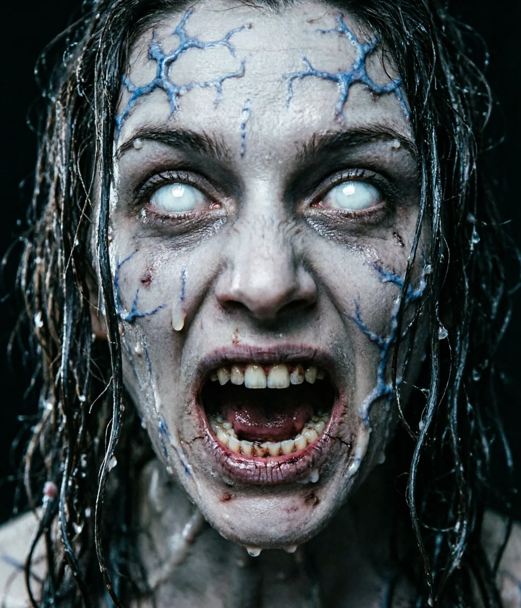

# The Hollow House (Ghost Game)

A first-person survival horror raycaster built from scratch with React 18, TypeScript, Tailwind CSS, and a custom DDA rendering engine.



## Quick Start

```bash
# Install dependencies
npm install

# Start local dev server
npm run dev

# Build for production
npm run build
```

The game runs locally on: **[http://localhost:3000](http://localhost:3000)**

## Complete Gameplay & Technical Documentation

For an in-depth breakdown of the storyline, the Seven Rites, ghost AI mechanics, math calculations (raycasting, lighting attenuation, battery drain, sanity formula), and tech stack details, read the comprehensive guide:

📖 **[GAMEPLAY.md](file:///Users/abhiishek/Developer/Vibe-Coding/Ghost-Game/GAMEPLAY.md)**

## Summary of Key Features

- **Custom DDA Raycaster**: Pure retro Wolfenstein-style rendering on HTML5 Canvas.
- **Photorealistic Tactical Flashlight Viewmodel**: High-resolution tactical torch with realistic Cree LED die, crenellated strike bezel, parabolic reflector dish, and operator combat glove with dynamic sway and inertial lag.
- **Volumetric Lighting & Atmospheric Haze**: Multi-layered volumetric light cone with floating dust motes, ambient light pool, and dynamic lens bloom.
- **Zero-Latency Procedural Audio**: 100% synthesized sound effects (heartbeats, footsteps, door creaks, clicks, screams) via Web Audio API.
- **Responsive Controls**: Full support for desktop keyboard/mouse and mobile touch joysticks.
